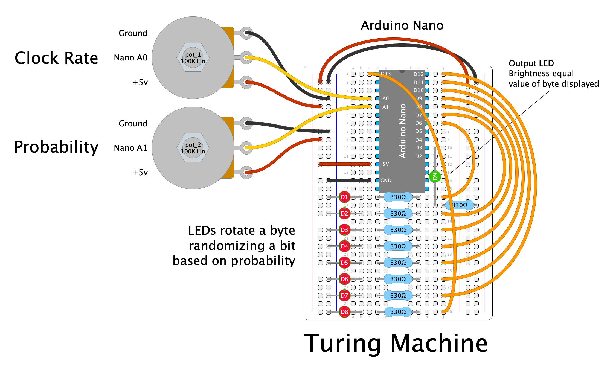

# Turing Machine - Arduino 

The goal of this project is emulate the functionality 
the Music Thing Module Turing Machine with an Arduino 
Nano. 

## History

- 8/20/22 Defined basic functionality
- 9/2/22 Added MsTimer updates now handled with interupt
